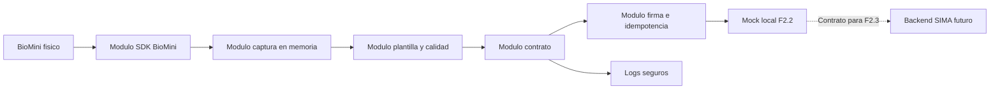

# Fase 2.2 - Servicio Local Windows BioMini Funcional Minimo

## 1. Resumen ejecutivo

Fase 2.2 define la frontera tecnica segura entre el lector fisico BioMini, el SDK del fabricante, un servicio local Windows en Python minimo y el backend SIMA futuro de Fase 2.3.

Esta fase no implementa backend IoT productivo, pantallas, migraciones SQL ni endpoints finales. Su salida principal es un contrato tecnico decision-complete para que Fase 2.3 pueda implementar recepcion, validacion y persistencia de intentos biometricos sin volver a decidir payloads, seguridad, errores ni responsabilidades.

| Decision | Valor |
|---|---|
| Stack servicio local | Python minimo |
| Comunicacion en Fase 2.2 | Mock local, sin endpoint backend productivo |
| SDK dentro de backend Node.js | Prohibido |
| RAW persistente | Prohibido |
| Cloudinary biometrico | Prohibido |
| Facial productivo | Fuera de Fase 2.2 |
| Fallback QR/manual | Obligatorio ante fallo del lector |

## 2. Contexto usado

| Fuente | Clasificacion | Hallazgo |
|---|---|---|
| `basededatos.sql` | Evidencia directa | Existe `intentos_asistencia_iot` con `evento_uuid`, `nonce`, `firma_evento`, `fecha_origen`, `expira_en` y `calidad_captura`. |
| Modelos Sequelize | Evidencia directa | Existe `iotAttendanceAttempts.js` y referencias `id_intento_iot` en evidencias/notificaciones. |
| `Ejemplohuella/Fast_api/app/capturar.py` | Evidencia directa | Usa `UFScanner.dll`, `UFExtractor.dll`, `UFS_Init`, `UFS_Update`, `UFS_GetScannerNumber`, `UFS_GetScannerHandle`, `UFS_CaptureSingleImage`, `UFS_ExtractEx` y `UFS_Uninit`; escribe archivos `.dat`, por tanto no es productivo. |
| `Ejemplohuella/Fast_api/app/fastapi_huella_sdk.py` | Evidencia directa | Expone endpoints demo, lee `huella_firma.dat`, usa base64 y guarda `registro_huellas.json`; se descarta para produccion. |
| Manual BioMini SDK 3.7.5 | Evidencia directa | Documenta captura, extraccion, calidad, verificacion e identificacion mediante funciones SDK confirmadas. |
| EP05/EP06/EP07 | Decision consolidada | Huella institucional por usuario, no RAW, no Cloudinary, QR/manual como fallback. |

## 3. Agentes especializados

| Agente | Rol | Objetivo | Alcance | Fuera de alcance | Salida esperada |
|---|---|---|---|---|---|
| A1 Coordinador tecnico F2.2 | Scrum Master tecnico | Ordenar dependencias y cierre | Roadmap, bloqueos, criterios entrada/salida | Codigo productivo | Checklist de cierre F2.2 |
| A2 Ingeniero SDK BioMini | Integracion SDK | Validar uso real del SDK | DLLs, inicializacion, captura, calidad, liberacion | Backend | Mapa SDK viable |
| A3 Arquitecto servicio local Windows | Arquitectura | Definir servicio Python modular | Captura, firma, contrato, logs, reintentos | Panel, movil, backend productivo | Arquitectura local sin RAW |
| A4 Security Lead biometrico | Seguridad | Evitar replay y fuga biometrica | Firma, nonce, secretos, logs, no RAW | PKI empresarial | Politica de seguridad |
| A5 Arquitecto contrato local-backend | Contrato | Definir operaciones logicas | Enrolamiento, asistencia, estado/incidente | Endpoints finales | Contrato listo para F2.3 |
| A6 QA biometrico local | QA | Diseñar pruebas locales y reales | Mock, lector, anti-replay, logs, no RAW | Automatizacion completa | Matriz QA |
| A7 DevOps Windows | Entorno | Validar Windows, driver, DLLs y permisos | PATH, 32/64 bits, firewall, proceso local | Instalador empresarial | Checklist entorno |
| A8 Auditor Ejemplohuella | Auditor tecnico | Clasificar reutilizable/descartable | Demo, DLLs, riesgos, patrones | Reescritura productiva | Matriz de decision |

## 4. Subfases internas

| Subfase | Objetivo | Entregables | Tareas |
|---|---|---|---|
| F2.2.0 | Confirmar dependencias | Checklist Windows, SDK, driver, DLLs, lector | F2.2-01 |
| F2.2.1 | Auditar `Ejemplohuella` | Matriz reutilizar/descartar | F2.2-02 |
| F2.2.2 | Diseñar servicio local | Modulos internos y flujos sin RAW | F2.2-03 a F2.2-06 |
| F2.2.3 | Cerrar contrato logico | Operaciones y payloads sin endpoints finales | F2.2-07 a F2.2-09 |
| F2.2.4 | Seguridad minima | Firma, nonce, expiracion, logs, secretos | F2.2-10, F2.2-12 |
| F2.2.5 | Fallos y resiliencia | Errores normalizados y backend no disponible | F2.2-11, F2.2-13 |
| F2.2.6 | QA local | Pruebas reales, simuladas y anti-replay | F2.2-14, F2.2-15 |
| F2.2.7 | Entrega a F2.3 | Paquete tecnico backend-ready | F2.2-16 |

## 5. Arquitectura objetivo del servicio local

El servicio local Windows debe ser un proceso separado del backend Node.js. En Fase 2.2 se planifica como Python minimo con mock local.

### Modulos internos

| Modulo | Responsabilidad | Prohibiciones |
|---|---|---|
| SDK BioMini | Inicializar SDK, detectar lector, obtener handle, liberar recursos | No exponer DLLs al backend |
| Captura | Capturar huella en memoria | No guardar imagen RAW |
| Plantilla | Extraer plantilla permitida para enrolamiento/asistencia | No escribir `.dat`, no loguear plantilla |
| Calidad | Obtener `calidad_captura` y validar rango | No usar score de matching como calidad |
| Contrato | Construir payload logico | No inventar endpoint final |
| Firma | Calcular `evento_uuid`, `nonce`, `firma_evento`, fechas | No guardar secretos en texto plano |
| Reintentos | Manejar backend/mock no disponible | No duplicar eventos |
| Logs | Registrar operacion tecnica segura | No RAW, no plantilla, no secretos |
| Estado lector | Reportar conectado, desconectado, error SDK, recuperado | No bloquear QR/manual |

## 6. Contrato logico local-backend

Fase 2.2 no define rutas HTTP finales. Define operaciones funcionales y datos minimos para mock local y entrega a F2.3.

### Operacion: enrolar huella

| Campo | Obligatorio F2.2 | Descripcion |
|---|---|---|
| `id_dispositivo` | Si | Dispositivo local registrado en SIMA |
| `id_usuario` | Si | Usuario a enrolar, validado por backend en F2.3 |
| `resultado` | Si | `EXITOSO`, `FALLIDO` o `RECHAZADO` |
| `calidad_captura` | Si cuando hay captura | Calidad 0-100 |
| `evento_uuid` | Si | Identificador unico del evento |
| `nonce` | Si | Valor anti-replay unico |
| `firma_evento` | Si | Firma del payload canonico |
| `fecha_origen` | Si | Fecha/hora generada localmente |
| `expira_en` | Si | Vencimiento del evento |
| `motivo` | Si en fallo/rechazo | Codigo controlado |
| `detalle` | Opcional | Descripcion sin datos biometricos |

Datos prohibidos: imagen RAW, plantilla en logs, secretos, imagen facial, Cloudinary.

### Operacion: validar asistencia

| Campo | Obligatorio F2.2 | Descripcion |
|---|---|---|
| `id_dispositivo` | Si | Lector activo |
| `id_sesion_formacion` | Si aplica | Sesion objetivo si el lector opera durante sesion |
| `id_usuario` | Si se identifica | `NULL` si no se identifica |
| `resultado` | Si | `EXITOSO`, `FALLIDO`, `RECHAZADO` |
| `calidad_captura` | Si cuando hay captura | Calidad 0-100 |
| `evento_uuid` | Si | Idempotencia |
| `nonce` | Si | Anti-replay |
| `firma_evento` | Si | Autenticidad |
| `fecha_origen` | Si | Origen temporal |
| `expira_en` | Si | Ventana de validez |
| `motivo` | Si en fallo/rechazo | Codigo controlado |
| `detalle` | Opcional | Sin biometria |

Responsabilidad de F2.3: validar dispositivo, sesion, aprendiz activo, duplicidad y consolidar asistencia/evidencia.

### Operacion: reportar estado/incidente

| Evento | Resultado | Motivo sugerido |
|---|---|---|
| Lector conectado | `EXITOSO` | `LECTOR_CONECTADO` |
| Lector desconectado | `FALLIDO` | `LECTOR_DESCONECTADO` |
| SDK no inicializa | `FALLIDO` | `SDK_NO_INICIALIZA` |
| Captura mala calidad | `RECHAZADO` | `CALIDAD_INSUFICIENTE` |
| Huella no identificada | `RECHAZADO` | `HUELLA_NO_IDENTIFICADA` |
| Backend/mock no disponible | `FALLIDO` | `DESTINO_NO_DISPONIBLE` |
| Recuperacion | `RECUPERADO` | `LECTOR_RECUPERADO` |

## 7. Seguridad minima

| Control | Regla F2.2 | Validacion esperada en F2.3 |
|---|---|---|
| Credencial del servicio | Debe existir como configuracion local protegida | Backend rechaza servicio no autorizado |
| `evento_uuid` | Unico por intento logico | Backend rechaza duplicado |
| `nonce` | Unico por evento firmado | Backend rechaza repetido |
| `fecha_origen` | Generada por servicio local | Backend valida ventana temporal |
| `expira_en` | Posterior a `fecha_origen` | Backend rechaza vencidos |
| `firma_evento` | Firma del payload canonico | Backend verifica integridad |
| Logs seguros | Solo evento, resultado, motivo, estado | Auditoria no expone biometria |
| No RAW | Captura en memoria y descarte | QA verifica ausencia de archivos |

### Payload canonico recomendado

El payload a firmar debe ordenar campos de forma estable y excluir `firma_evento`. En F2.2 se prueba contra mock local. El algoritmo final y almacenamiento de secreto se cierran en F2.3, pero F2.2 debe dejar el contrato listo.

## 8. Politica de logs seguros

Permitido:

- `evento_uuid`
- `id_dispositivo`
- `resultado`
- `motivo`
- timestamp local
- estado tecnico del lector
- duracion de operacion

Prohibido:

- imagen RAW
- plantilla biometrica
- plantilla en base64
- hash de plantilla si permite correlacion innecesaria en logs
- secreto del servicio
- firma secreta o clave
- contenido facial
- stack traces con rutas sensibles si exponen secretos

## 9. Manejo de fallos

| Fallo | Comportamiento local | Efecto sobre QR/manual |
|---|---|---|
| SDK no inicializa | Registrar incidente seguro y detener captura | No bloquea |
| Lector no detectado | Reportar estado `LECTOR_DESCONECTADO` | No bloquea |
| Captura mala calidad | Rechazar intento con motivo controlado | No bloquea |
| Huella no identificada | Registrar intento sin `id_usuario` | No bloquea |
| Mock/backend caido | Reintento controlado con mismo `evento_uuid` | No bloquea |
| Firma fallida | No enviar evento como valido | No bloquea |
| Duplicado local | No reenviar como nuevo intento | No bloquea |

## 10. Matriz `Ejemplohuella` -> decision

| Archivo/componente | Uso actual | Riesgo | Decision | Justificacion |
|---|---|---|---|---|
| `capturar.py` | Carga DLLs, inicializa, captura, extrae y guarda `.dat` | RAW y plantilla en disco | Reutilizar parcialmente | Sirve para entender llamadas SDK; descartar escritura de archivos |
| `fastapi_huella_sdk.py` | API demo, base64, JSON local | CORS, endpoints demo, comparacion exacta | No reutilizar | No cumple contrato ni seguridad SIMA |
| `capturar_wrapper.py` | Wrapper que genera `huella_firma.dat` | Persistencia biometrica | No reutilizar como produccion | Solo referencia diagnostica |
| `README_CAPTURA_BIOMETRICA.md` | Guia de demo | Puede inducir a copiar demo | Reutilizar parcialmente | Util para dependencias y flujo de prueba |
| `UFScanner.dll` | Modulo scanner | Arquitectura no confirmada | Reutilizar si valida | Necesaria para SDK |
| `UFExtractor.dll` | Extraccion en demo | Arquitectura no confirmada | Reutilizar si valida | Confirmada en demo local |
| `UFMatcher.dll` | Matching SDK | Arquitectura no confirmada | Reutilizar si valida | Necesaria para verificacion/identificacion |
| Archivos `.dat` | Resultado demo | Biometria persistida | No reutilizar | Evidencia de riesgo |
| `main.py`, `main2.py`, `utils.py` | Demo facial/CORS | Mezcla facial | No reutilizar | Facial fuera de F2.2 |
| `registro_huellas.json` | Registro demo | Almacenamiento inseguro | No reutilizar | SIMA usa backend/BD |

## 11. Matriz agente -> tareas

| Agente | Tareas | Entregable | Cierre |
|---|---|---|---|
| A1 | F2.2-01, F2.2-16 | Roadmap y cierre | F2.2 no invade F2.3 |
| A2 | F2.2-01, 04, 05, 06, 14 | Mapa SDK | SDK/captura/calidad verificables |
| A3 | F2.2-03, 05, 11, 12, 13 | Arquitectura local | Servicio sin RAW |
| A4 | F2.2-05, 10, 12, 15 | Seguridad | Firma/logs/no RAW cerrados |
| A5 | F2.2-07, 08, 09, 16 | Contrato | Payloads y errores listos |
| A6 | F2.2-06, 11, 14, 15 | QA | Casos reales y simulados |
| A7 | F2.2-01, 09, 13, 14 | Entorno | Windows/driver/DLL verificados |
| A8 | F2.2-02 | Auditoria demo | Reutilizacion segura definida |

## 12. Matriz contrato -> datos

| Operacion | Datos enviados | Datos prohibidos | Validaciones esperadas | Responsable |
|---|---|---|---|---|
| Enrolar huella | `id_dispositivo`, `id_usuario`, `resultado`, `calidad_captura`, `evento_uuid`, `nonce`, `firma_evento`, fechas, `motivo`, `detalle` | RAW, imagen, plantilla en logs | Calidad, firma, usuario activo, maximo dos huellas | Ambos en F2.3 |
| Validar asistencia | `id_dispositivo`, `id_sesion_formacion`, `id_usuario` o `NULL`, resultado, calidad, firma, fechas, motivo | RAW, facial, plantilla en logs | Dispositivo, sesion, aprendiz, duplicidad | Ambos en F2.3 |
| Reportar estado | dispositivo, resultado, motivo, firma, fechas | plantilla, RAW | Dispositivo conocido, firma | Ambos |
| Reportar incidente | dispositivo, motivo, detalle controlado, firma | stack sensible, biometria | Motivo controlado, idempotencia | Ambos |
| Recuperacion | dispositivo, `RECUPERADO`, firma, fechas | biometria | Estado previo opcional | Backend en F2.3 |

## 13. Matriz riesgo -> mitigacion

| Riesgo | Causa | Mitigacion | Severidad |
|---|---|---|---|
| SDK no inicializa | Driver/DLL/arquitectura | Validar entorno primero | Critica |
| Lector no detectado | Hardware/driver | Prueba fisica inicial | Critica |
| DLL incorrecta | 32/64 bits o PATH | Verificar DLLs y arquitectura Python | Alta |
| RAW accidental | Copiar demo | Captura en memoria y QA de archivos | Critica |
| Plantilla en logs | Logging inseguro | Politica de logs y pruebas | Critica |
| Evento sin firma | Contrato debil | Firma obligatoria | Critica |
| Replay | Nonce repetido | `nonce` y `evento_uuid` unicos | Critica |
| Falsificacion | HTTP sin autenticidad | Credencial + firma | Critica |
| Backend/mock caido | Red/proceso | Reintentos controlados | Alta |
| Reintentos duplican | Sin idempotencia | Mismo `evento_uuid` por intento | Alta |
| Copiar demo | Prisa tecnica | Auditoria de `Ejemplohuella` | Alta |
| CORS abierto | FastAPI demo | No reutilizar API demo | Alta |
| Mezclar facial | Demo facial presente | Facial fuera de F2.2 | Alta |
| QR/manual bloqueados | Dependencia lector | Fallback obligatorio | Critica |

## 14. Matriz F2.2 -> F2.3

| Entregable F2.2 | Habilita en F2.3 | Riesgo si falta |
|---|---|---|
| Checklist SDK/lector | Endpoint real con confianza | Backend sin prueba fisica |
| Arquitectura local | Integracion HTTP real | Servicio improvisado |
| Contrato enrolamiento | API enrolar/revocar | Enrolamiento inseguro |
| Contrato asistencia | API intentos/asistencia | Marcas falsas o duplicadas |
| Firma/nonce/idempotencia | Middleware de seguridad | Replay |
| Errores normalizados | Respuestas backend consistentes | Soporte imposible |
| QA real/mock | Pruebas backend | Cierre falso |
| Logs seguros | Observabilidad | Fuga biometrica |

## 15. Criterios de entrada

- F2.0/F2.1 cerradas o brechas criticas documentadas.
- `basededatos.sql` ejecuta limpio o queda marcado como bloqueo antes de F2.3.
- `intentos_asistencia_iot` definido.
- Lector BioMini disponible fisicamente.
- SDK/driver instalados o tarea de validacion abierta.
- Ambiente Windows disponible.
- Python minimo aprobado.
- Mock local aprobado para F2.2.
- No RAW confirmado.
- No Cloudinary confirmado.
- Facial productivo fuera de F2.2.
- QR/manual protegidos como fallback.

## 16. Criterios de salida

- Entorno Windows/SDK/lector verificado o bloqueo documentado.
- Auditoria `Ejemplohuella` completada.
- Arquitectura local definida.
- Flujo captura/extraccion sin RAW definido.
- Calidad `calidad_captura` definida.
- Contratos de enrolamiento, asistencia y estado cerrados.
- Firma, nonce, timestamp, expiracion e idempotencia definidos.
- Errores normalizados definidos.
- Logs seguros definidos.
- Matriz QA con lector real y mock local definida.
- Entregables de F2.3 definidos.
- QR/manual no afectados.

## 17. Fuera de Fase 2.2

| Elemento | Razon | Fase recomendada |
|---|---|---|
| Backend IoT productivo | Pertenece a recepcion y persistencia real | F2.3 |
| Panel SUPER_ADMIN | Depende de backend productivo | F2.4 |
| App movil | Depende de datos reales backend | F2.5 |
| Push | No bloquea biometria | Fase 3 |
| Facial SIMA productivo | Sin contrato/proveedor cerrado | Fase futura |
| Dashboard avanzado | Sobrealcance | Fase 3 |
| Analitica | Prematura | Fase 3/4 |
| Control de puertas | Dominio distinto | Fase posterior |
| Instalador empresarial | Sobrealcance | Fase 3 |
| Cloudinary biometrico | Prohibido | No recomendado |
| RAW persistente | Prohibido | No recomendado |
| Score obligatorio matching | No requerido | Fase posterior |

## 18. QA minimo de Fase 2.2

### Sin lector

- Mock local acepta payload firmado valido.
- Mock local rechaza firma invalida.
- Mock local rechaza `nonce` repetido.
- Mock local rechaza `evento_uuid` repetido.
- Evento vencido se rechaza.
- Logs no contienen plantilla, RAW ni secreto.
- Backend/mock no disponible no bloquea QR/manual.

### Con lector real

- SDK inicializa correctamente.
- Lector detectado.
- Captura exitosa.
- Mala calidad genera rechazo controlado.
- Huella no identificada genera intento con usuario `NULL`.
- `UFS_Uninit` o liberacion equivalente se ejecuta al finalizar.
- No se generan archivos `.dat`, `.bmp`, `.wsq` ni equivalentes.
- Logs solo contienen datos permitidos.

## 19. Checklist anti-alucinacion

| Control | Estado |
|---|---|
| Entorno Windows confirmado | Pendiente F2.2-01 |
| SDK/driver confirmado | Pendiente F2.2-01 |
| Lector confirmado tecnicamente | Pendiente F2.2-01 |
| Archivos `Ejemplohuella` auditados | Parcial, matriz incluida |
| Demo insegura descartada | Si |
| RAW evitado | Si |
| Cloudinary evitado | Si |
| Plantilla en logs evitada | Si |
| Endpoints finales no inventados | Si |
| F2.3 no invadida | Si |
| Facial separado | Si |
| QR/manual preservados | Si |

## 20. Veredicto

El proyecto esta listo para iniciar Fase 2.2 como servicio local Windows Python minimo con mock local. El primer bloqueo real es tecnico: confirmar driver, SDK, DLLs, arquitectura Python/Windows y deteccion fisica del lector.

El camino seguro es:

1. Validar entorno y lector.
2. Auditar y descartar partes inseguras de `Ejemplohuella`.
3. Diseñar servicio modular.
4. Cerrar seguridad y contrato.
5. Probar con mock local.
6. Probar con lector real.
7. Entregar payloads, errores y criterios a Fase 2.3.
